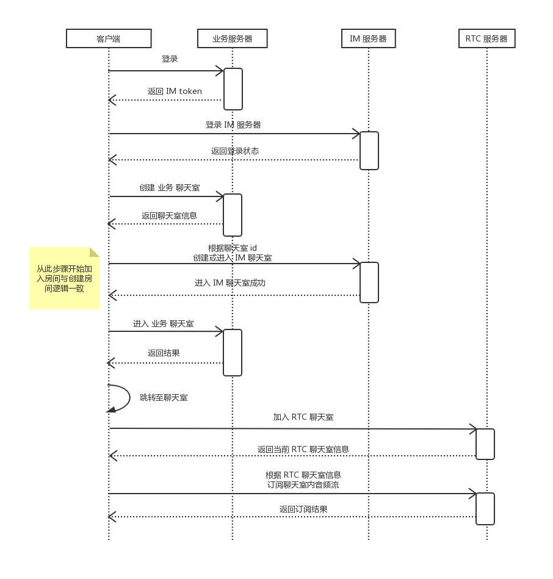
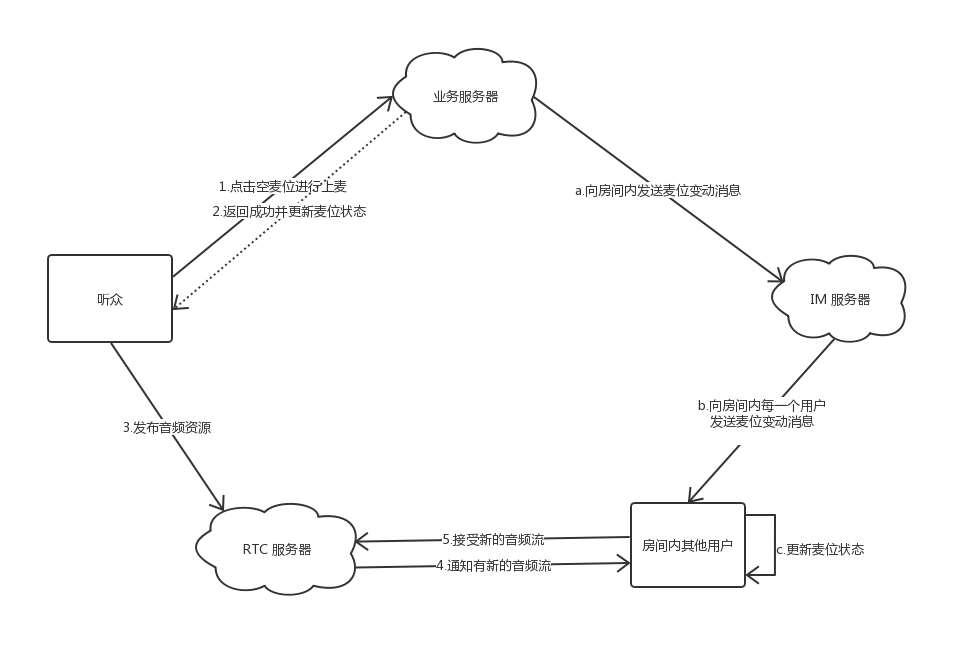
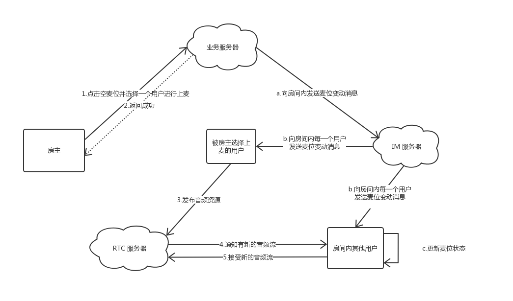
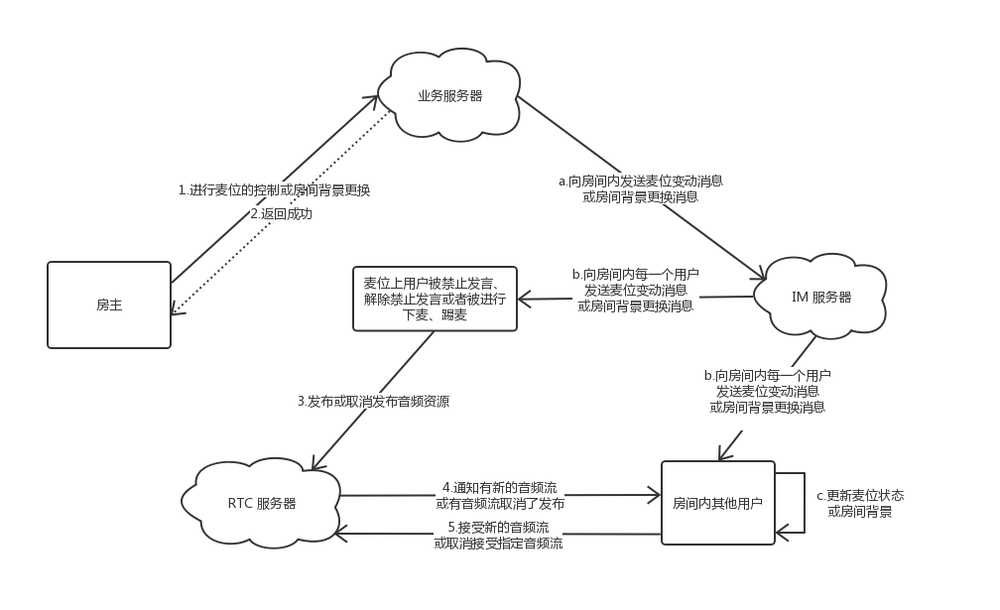

# SealMic-Android  
本文档介绍了 SealMic 的整体框架设计和核心流程，为开发者了解 SealMic 的主要功能提供指导性说明。[体验 SealMic](https://www.rongcloud.cn/download/demo) 。

## 背景介绍
---
SealMic 展示了如何通过融云 IM SDK 和 RTC SDK 实现音频社交功能。  

* **IM SDK : 融云 IM 即时通讯 SDK** &emsp;

* **RTC SDK : 融云实时音视频 SDK**

## 主要功能介绍  
---
SealMic 主要由两个页面构成：语音聊天室列表页和语音聊天室详情页面。  
* **语音聊天室列表页** &emsp;  
展示了当前所有创建的聊天室，可以选择加入某个聊天室或创建新聊天室。
* **语音聊天室详情页** &emsp;  
展示了当前语音聊天室内的麦位及用户信息。
所有在语音聊天室内的用户可以发送文字进行聊天。  
房主和在麦位上的用户可进行语音聊天。  
房主可针对麦位进行控制，比如限制在麦位上的用户发言或限制用户进行上麦操作。  
房主可更改聊天室的背景来使聊天室内所有的用户同时看见当前新的聊天室的背景。  

 ** 特别说明：为了重点演示 SealMic 核心功能，SealMic 中简化了部分逻辑：**
*  没有用户管理体系，而是根据用户 id 的 hashcode 值取余后生成对应资源的 index.
*  目前语音聊天室设置的最长聊天时间为 2 小时， 2 小时后自动销毁。 如果您需要聊天室长时间保活，可以开通私有云服务，启用保活聊天室即可。

## 语音聊天室的概念
---
在 SealMic 中有三个抽象概念的语音聊天室，虽然使用相同的 id 但功能范围各不同：
* **业务层面的语音聊天室** &emsp;在用户创建聊天室时请求业务服务器，业务服务器创建聊天室，并返回给创者者当前聊天室的 id，同时其他用户可通过获取聊天室列表接口获取到此聊天室的 id。用户调根据此聊天室 id 加入 IM 聊天室和音频 RTC 房间。当前用户属于哪个聊天室，当前聊天室内有哪些用户是基于此聊天室。
* **IM 即时通讯层面的语音聊天室** &emsp;加入 IM 聊天室后，用户可以发送文本消息聊天。另外维护聊天室各种状态的信令消息也通过 IM 服务来收发。  
* **RTC 音频层面的语音聊天室** &emsp; 加入 RTC 聊天室后，用户可以获得到当前语音聊天室内所有发布音频流的用户，并选择订阅音频流来收听目标用户的声音，也可以自己发布音频流让其他人听到自己的声音。

以下是用户加入语音聊天室并进行语音聊天过程的时序。  

  

说明：为了防止用户在调用业务服务器加入聊天室与加入 IM 聊天室之间的消息丢失，需要先加入 IM 服务器，再调用业务服务器加入聊天室。
## 语音聊天室中的角色  
---  
语音聊天室中一共有三个角色：
* **听众** &emsp; 加入聊天室后用户的默认角色。可以进行文字交流，并收听聊天室内其他用户的发言。可以选择空麦位进行上麦操作；或者由 *房主* 以抱麦形式上麦，上麦后成为 *连麦者* 进行语音发言。
* **连麦者** &emsp; 可进行语音发言，也可以随意更更改到其他空的麦位上，即跳麦；也可以选择下麦变回 *听众*。
* **房主** &emsp; 即语音聊天室的创建者。  
房主具有房间的控制能力。
房主可以更改聊天室中的麦位的状态。  
房主可以选择房间内的某个 *听众* 上麦，使其成为连麦者。  
房主可以使 *连麦者* 下麦变为 *听众* 或将 *连麦者* 踢出聊天室。  
房主可以更改聊天室内的背景使聊天室内的其他用户同步更新此背景。  
房主可以解散聊天室，当房主退出或者解散聊天室时聊天室内的其他用户会受到通知并退出聊天室。

## 语音聊天室中的麦位
在 SealMic 聊天室中一共有8个麦位，只有房主和在麦位上的用户可以进行发言。房主可以对麦位进行控制，麦位一共有以下几个状态：
* **空麦位** &emsp; 听众可以上麦，连麦者可进行跳麦到此麦位，房主可进行抱麦使听众上麦。
* **麦位被禁止发言** &emsp; 在禁止发言的麦位上，连麦者无法进行语音发言。
* **麦位被锁定** &emsp; 在被锁定的麦位上，听众无法进行上麦操作，连麦者无法进行跳麦操作。

## 用户上麦流程
---
以下流程图简述了听众进行上麦操作时，用户与各个服务器的之间的交互。  

## 房主抱麦流程
---
以下流程图简述了房主抱麦时，被抱麦的听众及其他用户与各个服务器之间的交互流程。  

## 房主麦位管理和更换聊天室背景流程
---
以下流程图简述了房主进行麦位控制和更换聊天室背景时，其他用户与各个服务器之间的交互并完成同步更新的流程。  

## 代码目录介绍  
---
Android 端代码主要由 ui，task，net，im，rtc 五个包组成。  
* **ui** &emsp;包含所有显示相关的组件。包含 聊天室界面 ChatRoomActivity，主界面和聊天室界面使用到一些控件。
* **task** &emsp;对于首页和聊天室内的业务处理。UI 层直接调用 task 包中的业务管理类进行业务操作，由这些管理类去调用 net，im，rtc 包中对应类的方法去实现相应操作并将结果反馈给 UI。主要业务由以下三个管理类实现： AuthManager 管理用户登录业务，RoomManager 管理聊天室相关业务，ThreadManager 管理线程。
* **net** &emsp;对于所有关于 SealMic 业务逻辑上的网络请求封装。网络部分使用 Retrofit 2.0 框架进行封装。
* **im** &emsp;对应 SealMic 中使用 融云 IMLib 对即时通讯部分的封装和自定义消息的实现。自定义消息包括聊天室麦位更改消息，聊天室背景改变消息。
* **rtc** &emsp;对应 SealMic 中使用 融云 RTCLib 对音频聊天相关的功能封装。

其他包由以下几个组成：
* **constant** &emsp;定义了网络相关常量和业务错误代码。
* **model** &emsp;业务中使用的模型对象和枚举。
* **utils** &emsp;包括日志打印，Toast 提示等辅助工具，随机资源素材管理。

在根目录下有以下两个类：
* **SealMicApp** &emsp;应用的 Application 类，在应用启动时初始化了 融云 IMLib 及其他组件。
* **MainActivity** &emsp;应用的主界面，展示了当前已创建的聊天室列表。

## 运行环境
---
* Android Studio 3.2&ensp;以上版本  
SealMic 适配了 Android X，所以需要 使用 3.2&ensp;以上版本的 Android Studio 才能保证可以正常编译和使用。
* 推荐使用真实 Android 设备  
部分模拟器会存在功能缺失或运行环境不稳定等情况影响使用体验。

## 文档链接
---
* 关于 Android IM 即时通讯 SDK 的 [开发指南](https://www.rongcloud.cn/docs/android.html)
* 关于 Android 音视频通讯 SDK 的 [开发指南](https://www.rongcloud.cn/docs/android_rtclib.html)
* SealMic Server 源码可以参考[这里](https://github.com/rongcloud/sealmic-server)  

## 联系我们  
---
* 如果发现了示例代码的 bug, 欢迎提交 [issue](https://github.com/rongcloud/sealmic-android/issues)
* 如果有售前咨询问题, 可以拨打 13161856839 进行咨询。
